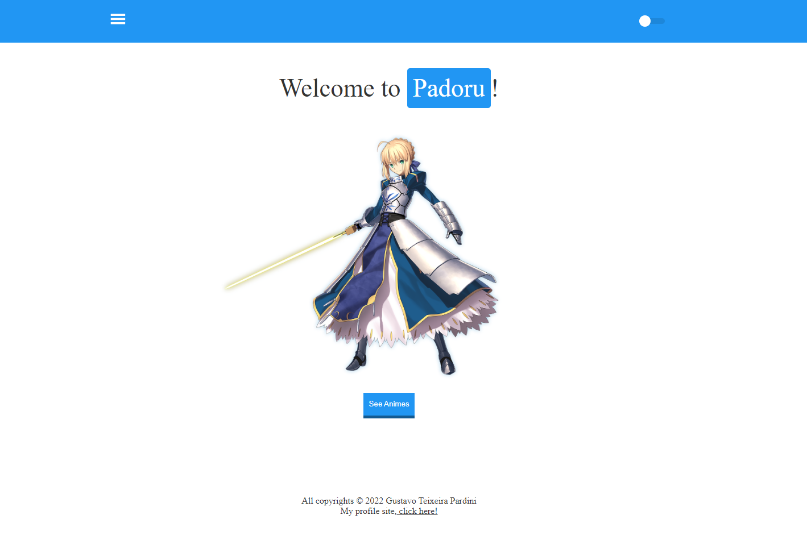
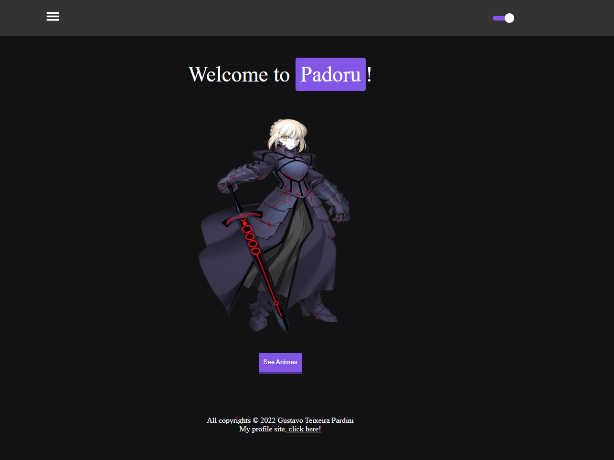
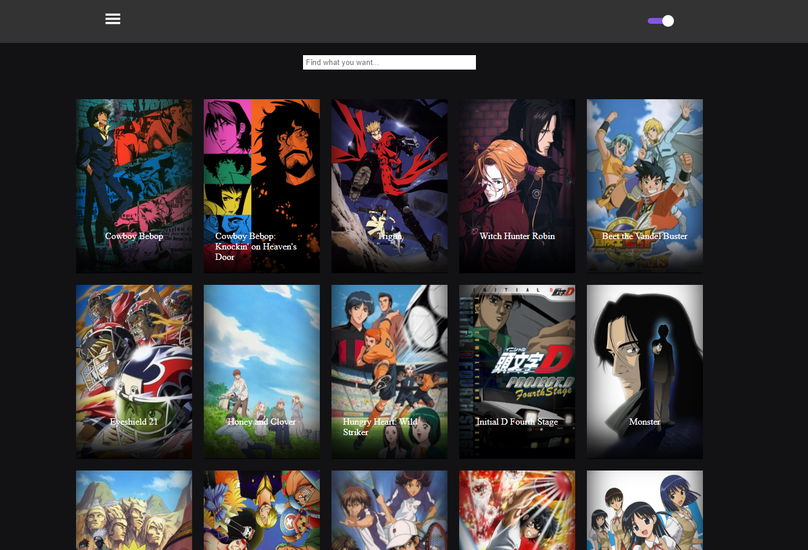
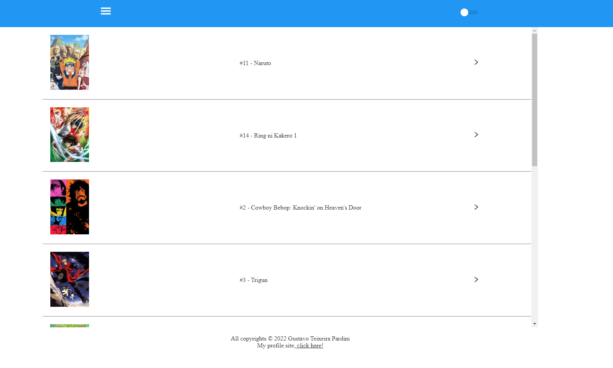
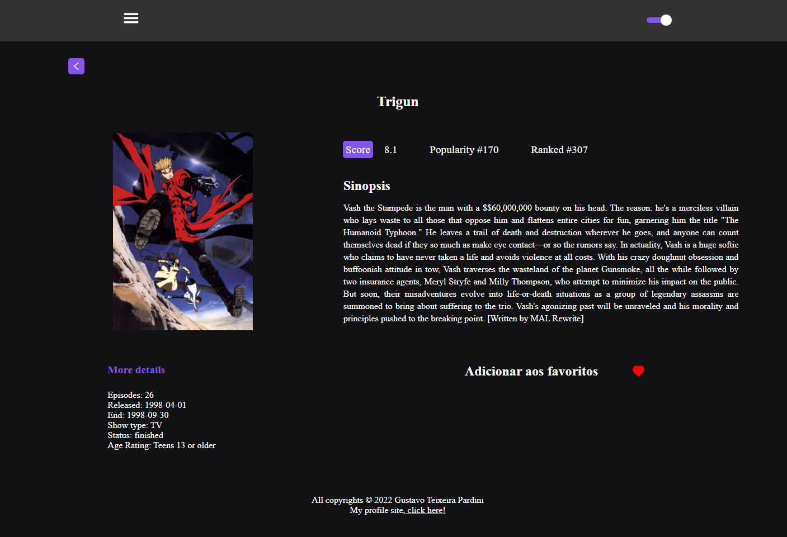

<h1 align="center"> MyAnimeList - Padoru !! Merry Christmas </h1>

Esse projeto foi construído com o intuíto de aprimorar minhas habilidades, projeto 100% responsivo utilizando KITSU API para construção de um buscador de animes com filtro de pesquisa e paginação.

# 🔨 Improvements

- `UseContext`: Aprendi como utilizar o UseContext para gerenciar estados globais da aplicação. No caso dessa aplicação foi utilizado para compartilhar o tema entre os componentes e poder gerenciar os favoritos.

- `LocalStorage`: Junto ao UseContext, aprendi como utilizar o LocalStorage para persistir os dados da aplicação, mesmo quando der um refresh na pagina. Dessa forma, pude armazenar os temas e os favoritos.

- `Memo`: Aprendi como utilizar Memo para melhorar o desempenho da aplicação, evitando diversas renderizações quando o estado alterar.

- `TypeScript`: Continuo aprimorando meus conhecimentos sobre TypeScript

# 📷 Screenshoots

# 🌐 Go to the Website !!
[Go to WebSite - Click Me !](https://padoru-opal.vercel.app)
